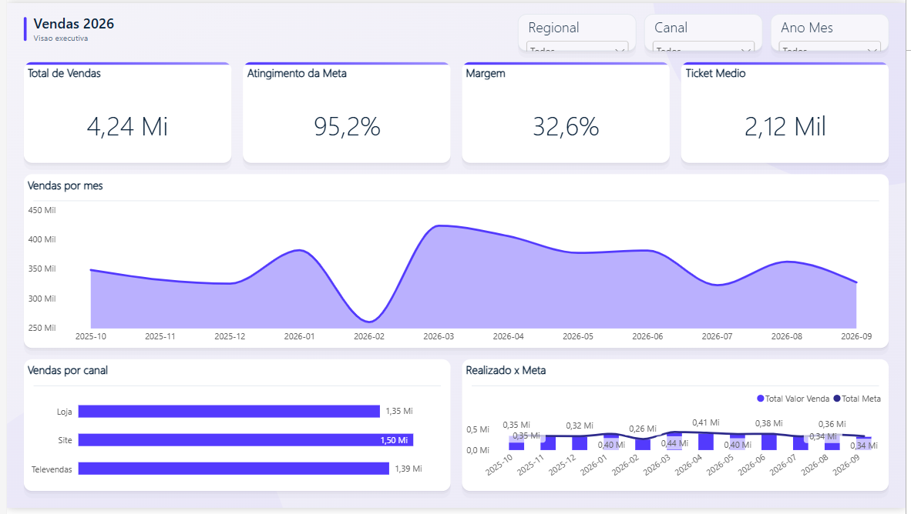
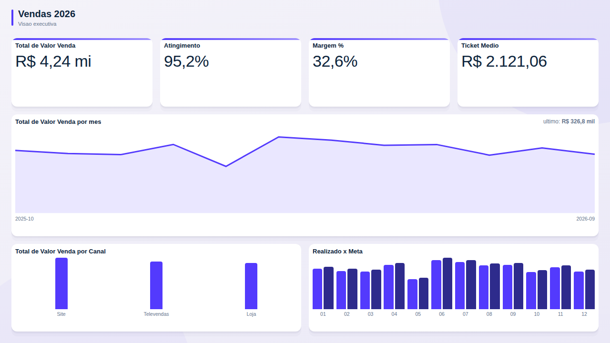

<div align="center">

# powerbi-mcp-studio

[](https://github.com/djorshuam/powerbi-mcp-studio/actions)


**Da planilha ao relatório Power BI pronto — com Claude Code + MCP.**

Modelo estrela, DAX organizado, páginas com visuais nativos, fundo moderno, tema com contraste validado e auditoria — tudo a partir de uma conversa.



<sub>Página gerada de ponta a ponta: modelo, medidas, layout, fundo e tema.</sub>

</div>

## Por que existe

O [MCP oficial da Microsoft](https://github.com/microsoft/powerbi-modeling-mcp) deixa o Claude mexer no **modelo** (medidas, tabelas, relações). É ótimo — mas para por aí. O **powerbi-mcp-studio** é uma skill que usa esse MCP e completa o que falta para entregar um relatório de verdade:

| Só com o MCP | Com o powerbi-mcp-studio |
|---|---|
| Não cria gráficos nem mexe no visual | Cria páginas e visuais nativos com acabamento profissional, fundo e tema |
| `.pbix` limitado; recomenda-se `.pbip` | Edita **`.pbix` direto** (padrão) e também `.pbip` |
| Você atualiza manualmente após cada mudança | Faz o refresh pelo MCP e **valida os números** com DAX |
| DAX às vezes sai errado | Testa cada medida e roda **auditoria com nota 0–100** |
| Você decide sozinho o que visualizar | **Recomenda visuais** a partir dos dados, explicando o porquê |
| Configuração manual de JSON e caminhos | **Instalação em uma linha** |

## Instalação (3 passos)

> **Usa o app Claude Desktop (inclusive gratuito)?** Siga o **[passo a passo do INSTALACAO.md](INSTALACAO.md)**: tem instalador automático do MCP para Windows.

1. **Skill + agentes**
   ```bash
   npx github:djorshuam/powerbi-mcp-studio
   ```
   Opções: `--projeto` (só no projeto atual) · `--zip` (gera o zip para o app Claude) · `--desinstalar`.
   <details><summary>Ou como plugin do Claude Code</summary>

   ```
   /plugin marketplace add djorshuam/powerbi-mcp-studio
   /plugin install powerbi-mcp-studio@powerbi-mcp-studio
   ```
   </details>
   <details><summary>Sem npx (app Claude ou instalação manual)</summary>

   - **App Claude (desktop/web):** baixe **[powerbi-mcp-studio.zip](https://github.com/djorshuam/powerbi-mcp-studio/raw/main/dist/powerbi-mcp-studio.zip)** e envie em *Configurações → Capacidades → Skills*.
     ⚠️ Não use o "Code → Download ZIP" do GitHub: ele traz o repositório inteiro e o app recusa.
   - **Claude Code manual:** descompacte esse mesmo zip em `~/.claude/skills/` (fica `~/.claude/skills/powerbi-mcp-studio/SKILL.md`) e copie `agents/*.md` do repositório para `~/.claude/agents/`.
   - O `npx github:...` precisa do **Git** instalado e do Node.js 18+. Se der erro, use uma das opções acima.
   </details>

2. **MCP do Power BI**
   ```bash
   claude mcp add powerbi-modeling --scope user -- npx -y @microsoft/powerbi-modeling-mcp@latest --start --readwrite --require-confirmation
   ```

3. **Abra o relatório no Power BI Desktop** e peça ao Claude Code.

**Pré-requisitos:** Windows com Power BI Desktop · Node.js 18+ · Python 3.9+ · plano pago do Claude (Claude Code).
Opcionais: Playwright (prévias), Pillow (paleta a partir de mockup), token do Figma (fundos), app Claude desktop com *Computer use* (conferência visual).

## O que dá para pedir

> "Transforma essa planilha de vendas num dashboard no Power BI."
> "Audita esse modelo e me diz o que está errado."
> "Aplica o estilo Stripe nesse relatório, em modo escuro."
> "Converte esse dashboard em Excel/HTML para Power BI."
> "Troca o fundo da página pelo frame do Figma."

## Recursos

| | |
|---|---|
| **Planilha → dashboard** | Perfila as colunas, recomenda visuais, cria modelo estrela, `Calendario`, tabela `_Medidas` com pastas e monta as páginas. Também gera uma versão HTML interativa. |
| **Visuais nativos com acabamento** | Títulos, transparência sobre cartões, sem grades, rótulos, legendas e segmentações no cabeçalho — aplicado automaticamente. |
| **10 layouts de mercado** | Executivo, scorecard, NOC, DRE, funil, comparativo de períodos… com fundo SVG gerado nas posições exatas dos visuais. |
| **Temas a partir de DESIGN.md** | Galeria com 74 estilos, contraste WCAG ajustado, modo claro/escuro. |
| **Auditoria do modelo** | Nota 0–100, erros, relações arriscadas, itens sem uso, DAX de risco, dicionário de dados e checklist de publicação. |
| **Edição direta do arquivo** | Páginas, visuais, fundos e temas no `.pbix`/`.pbip` sem abrir a interface, com backup e validação. |
| **Figma** | Fundos de página e posicionamento de visuais a partir de frames. |
| **1.512 ícones Phosphor** | Offline, em SVG, DAX ou HTML. |
| **Agentes** | `construtor-dashboard`, `designer-powerbi`, `auditor-powerbi`, `revisor-visual`, `conversor-dashboard`. |

## Dicas para dar certo

- Salve o relatório numa **pasta local** (fora de OneDrive/Google Drive), com nome curto e sem acentos.
- Deixe **um relatório aberto** por vez no Power BI Desktop.
- Dê **contexto de negócio** no pedido ("meta mensal por regional", "margem = venda − custo").
- Para editar páginas e temas, o Claude pede para **fechar** o Power BI; para mexer no modelo, ele precisa estar **aberto**. A skill avisa quando.

## Perguntas frequentes

**Precisa saber programar?** Não. Você conversa; os scripts rodam por trás.
**.pbix ou .pbip?** Os dois. `.pbix` é o padrão.
**Funciona em relatório publicado no serviço?** Não — trabalha no Power BI Desktop, local.
**Mexe no meu arquivo sem backup?** Nunca. Todo script faz backup antes de gravar.

## Limitações

- Só Windows / Power BI Desktop.
- Revise antes de publicar — a IA acelera, o julgamento continua sendo seu.
- Alterar páginas de um `.pbix` remove a parte `SecurityBindings` (senão o Desktop acusa arquivo corrompido). Se o relatório tinha rótulo de sensibilidade, reaplique.

<details><summary>Modo HTML Content (opcional)</summary>

A skill também gera a página com o visual HTML Content, a partir de medidas DAX que montam HTML/SVG. Fica idêntica a um dashboard web, mas **não é clicável** (não filtra outros visuais). Por isso o padrão são os visuais nativos.


</details>

## Estrutura
```
skills/powerbi-mcp-studio/  SKILL.md (roteador), scripts/ (Python, sem dependências obrigatórias),
                            references/, layouts/, designs/, icones/, vendor/, clientes/_exemplo/
agents/                     5 subagentes do Claude Code
.claude-plugin/             manifesto de plugin e marketplace
bin/install.js              instalador (npx)
```

## Contribuir
Issues e PRs são bem-vindos — veja [CONTRIBUTING.md](CONTRIBUTING.md). Histórico em [CHANGELOG.md](CHANGELOG.md).

## Licença
MIT © David Jorshuam · J Tech. Terceiros: galeria de design (MIT, [VoltAgent/awesome-design-md](https://github.com/VoltAgent/awesome-design-md)), [Phosphor Icons](https://phosphoricons.com) (MIT), [Apache ECharts](https://echarts.apache.org) (Apache-2.0).
Projeto independente, sem afiliação com a Microsoft ou a Anthropic. Power BI é marca da Microsoft; Claude é marca da Anthropic.
