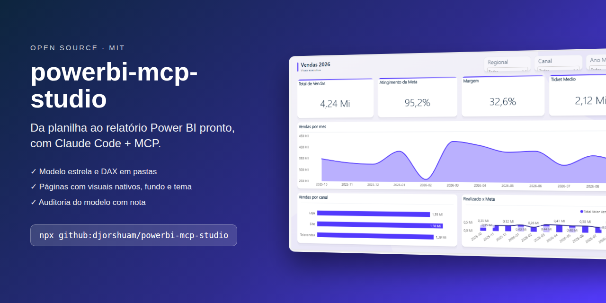
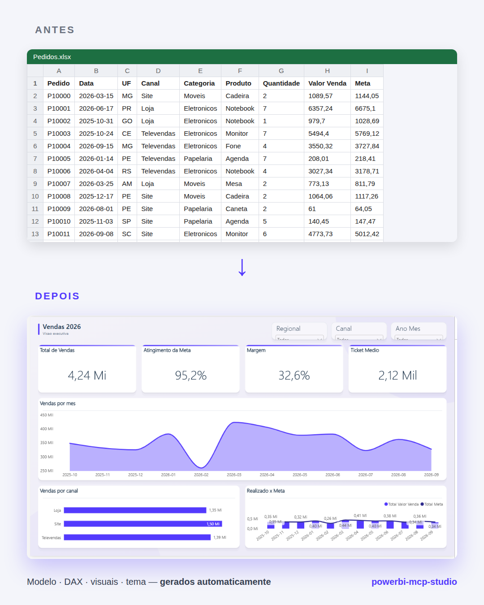

<div align="center">



[](https://github.com/djorshuam/powerbi-mcp-studio/actions)


### Da planilha ao relatório Power BI pronto — com Claude + MCP

**[Começar](#-comece-aqui)** · **[Como funciona](#-como-funciona)** · **[Instalação](#-instalação)** · **[O que pedir](#-o-que-dá-para-pedir)** · **[Problemas?](INSTALACAO.md#problemas-comuns-vistos-em-instalações-reais)**

</div>

---

## 🚀 Comece aqui

Escolha onde você usa o Claude:

| | Claude Code ou Cowork | Conversa comum (inclusive grátis) |
|---|---|---|
| **Plano** | pago — Pro, Max, Team, Enterprise | qualquer |
| **Conecta no Power BI aberto** | ✅ sim (MCP) | ❌ não |
| **Planilha → dashboard, temas, auditoria** | ✅ | ✅ com arquivos anexados |
| **Instalação** | [3 passos](#-instalação) | só [baixar o zip](https://github.com/djorshuam/powerbi-mcp-studio/raw/main/dist/powerbi-mcp-studio.zip) e enviar em *Configurações → Skills* |

> [!IMPORTANT]
> A skill **não instala o MCP sozinha**: o MCP do Power BI roda no seu computador e é configurado uma vez. O [instalador para Windows](INSTALACAO.md) faz isso com um clique.

---

## 🔁 Como funciona

<table>
<tr>
<td width="50%"></td>
<td width="50%"></td>
</tr>
</table>

O [MCP oficial da Microsoft](https://github.com/microsoft/powerbi-modeling-mcp) deixa o Claude mexer no **modelo**. O powerbi-mcp-studio completa o que falta para entregar o **relatório**:

| Só com o MCP | Com o powerbi-mcp-studio |
|---|---|
| Não cria gráficos nem mexe no visual | Páginas com visuais nativos, fundo e tema |
| `.pbix` limitado | Edita **`.pbix` direto** (e `.pbip`) |
| Você confere tudo na mão | **Valida os números** com DAX e audita o modelo (nota 0–100) |
| Você decide o que visualizar | **Recomenda visuais** a partir dos dados |

---

## 📦 Instalação

> [!TIP]
> **Usa o app Claude Desktop?** Siga o **[passo a passo do INSTALACAO.md](INSTALACAO.md)** — tem instalador automático e tabela de problemas comuns.

**Claude Code — 2 comandos:**

```bash
npx github:djorshuam/powerbi-mcp-studio
claude mcp add powerbi-modeling --scope user -- npx -y @microsoft/powerbi-modeling-mcp@latest --start --readwrite --require-confirmation
```

Depois, abra o relatório no Power BI Desktop e converse com o Claude.

<details><summary><b>Outras formas</b> (plugin, sem npx, manual)</summary>

- **Plugin do Claude Code:** `/plugin marketplace add djorshuam/powerbi-mcp-studio` e `/plugin install powerbi-mcp-studio@powerbi-mcp-studio`
- **Sem npx:** baixe [powerbi-mcp-studio.zip](https://github.com/djorshuam/powerbi-mcp-studio/raw/main/dist/powerbi-mcp-studio.zip), descompacte em `~/.claude/skills/` e copie `agents/*.md` para `~/.claude/agents/`.
- O `npx github:` precisa de **Git** e **Node.js 18+**.
- Opções do instalador: `--projeto` (só no projeto atual) · `--zip` · `--desinstalar`.
</details>

**Pré-requisitos:** Windows · Power BI Desktop · Node.js 18+ · Python 3.9+

---

## 💬 O que dá para pedir

```text
Transforma essa planilha de vendas num dashboard no Power BI.
Audita esse modelo e me diz o que está errado.
Aplica o estilo Stripe nesse relatório, em modo escuro.
Converte esse dashboard em Excel para Power BI.
Troca o fundo da página pelo frame do Figma.
```

---

## ✨ Recursos

| | |
|---|---|
| 📊 **Planilha → dashboard** | Perfila os dados, recomenda visuais, cria modelo estrela, `Calendario` e `_Medidas` com pastas, e monta as páginas. Também gera uma versão HTML. |
| 🎨 **Visual profissional** | Visuais nativos com acabamento, 10 layouts de mercado, fundo SVG gerado, 74 estilos de tema com contraste WCAG e modo escuro. |
| 🔍 **Auditoria** | Nota 0–100, relações arriscadas, itens sem uso, DAX de risco, dicionário de dados e checklist de publicação. |
| 🛠️ **Edição do arquivo** | Páginas, visuais, fundos e temas no `.pbix`/`.pbip` sem abrir a interface — com backup e validação. |
| 🧩 **Extras** | Fundos do Figma · 1.512 ícones Phosphor · conversão de dashboards Excel/HTML · 5 agentes especializados. |

---

<details><summary><b>💡 Dicas para dar certo</b></summary>

- Salve o relatório numa **pasta local** (fora de OneDrive/Google Drive), com nome curto e sem acentos.
- Deixe **um relatório aberto** por vez.
- Dê **contexto de negócio** no pedido ("meta mensal por regional", "margem = venda − custo").
- Para editar páginas e temas, o Claude pede para **fechar** o Power BI; para mexer no modelo, ele precisa estar **aberto**.
</details>

<details><summary><b>❓ Perguntas frequentes</b></summary>

- **Precisa saber programar?** Não. Você conversa; os scripts rodam por trás.
- **.pbix ou .pbip?** Os dois. `.pbix` é o padrão.
- **Funciona no plano gratuito?** Só com arquivos anexados. Conectar no Power BI aberto exige Claude Code ou Cowork (plano pago).
- **Funciona em relatório publicado no serviço?** Não — trabalha no Power BI Desktop.
- **Mexe no meu arquivo sem backup?** Nunca.
</details>

<details><summary><b>⚠️ Limitações</b></summary>

- Só Windows / Power BI Desktop.
- Revise antes de publicar — a IA acelera, o julgamento continua sendo seu.
- Alterar páginas de um `.pbix` remove a parte `SecurityBindings`; se o relatório tinha rótulo de sensibilidade, reaplique.
- Modo HTML Content (opcional): fica idêntico a um dashboard web, mas **não é clicável**. Por isso o padrão são visuais nativos.
</details>

<details><summary><b>📁 Estrutura do repositório</b></summary>

```
skills/powerbi-mcp-studio/  SKILL.md, scripts/ (Python), references/, layouts/, designs/, icones/
agents/                     5 subagentes do Claude Code
instalar/                   instalador do MCP para Windows
dist/                       zip pronto para o app Claude
.claude-plugin/             manifesto de plugin
bin/install.js              instalador (npx)
```
</details>

---

<div align="center">

**[Contribuir](CONTRIBUTING.md)** · **[Changelog](CHANGELOG.md)** · **[Instalação detalhada](INSTALACAO.md)**

MIT © David Jorshuam · J Tech
<sub>Terceiros: [awesome-design-md](https://github.com/VoltAgent/awesome-design-md) (MIT) · [Phosphor Icons](https://phosphoricons.com) (MIT) · [Apache ECharts](https://echarts.apache.org) (Apache-2.0).<br>Projeto independente, sem afiliação com a Microsoft ou a Anthropic. Power BI é marca da Microsoft; Claude é marca da Anthropic.</sub>

</div>
