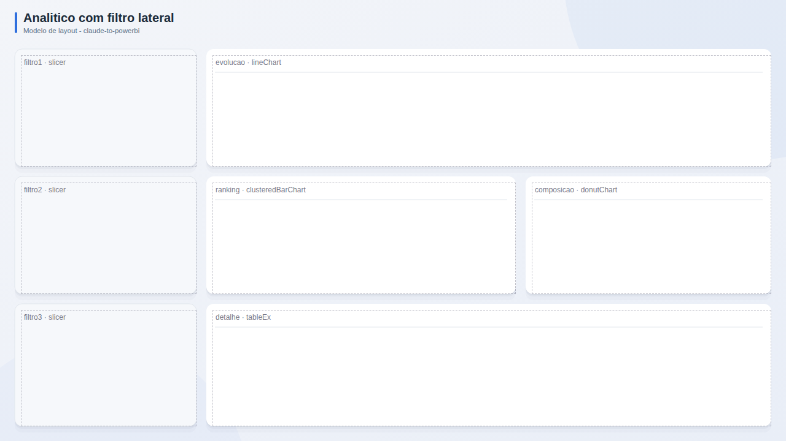

# Analitico com filtro lateral

**Publico:** analistas  
**Quando usar:** exploracao livre com muitos filtros

## Estrutura
Coluna de segmentacoes a esquerda; area de analise com 2 graficos e tabela.

## Slots
| Slot | Visual | Titulo sugerido | Posicao (x, y, LxA) |
|---|---|---|---|
| `filtro1` | slicer | Periodo | 24, 80, 296x192 |
| `evolucao` | lineChart | Evolucao | 336, 80, 920x192 |
| `filtro2` | slicer | Regiao | 24, 288, 296x192 |
| `ranking` | clusteredBarChart | Ranking | 336, 288, 504x192 |
| `composicao` | donutChart | Composicao | 856, 288, 400x192 |
| `filtro3` | slicer | Categoria | 24, 496, 296x200 |
| `detalhe` | tableEx | Detalhe | 336, 496, 920x200 |

## Boas praticas deste layout
- Filtros na ordem do funil de decisao (periodo > regiao > produto).
- Botao de limpar filtros.
