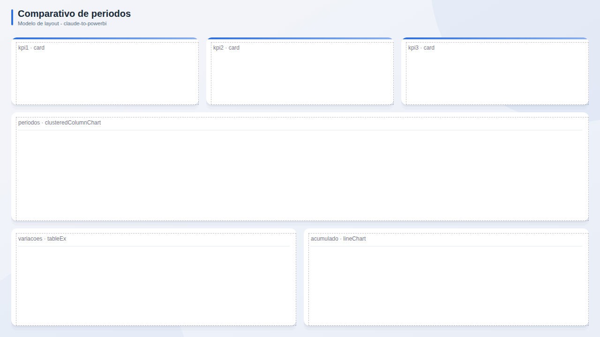

# Comparativo de periodos

**Publico:** gestores  
**Quando usar:** este periodo x anterior x mesmo periodo do ano passado

## Estrutura
KPIs com variacao, grafico de colunas agrupadas por periodo e tabela de variacoes.

## Slots
| Slot | Visual | Titulo sugerido | Posicao (x, y, LxA) |
|---|---|---|---|
| `kpi1` | card | KPI 1 | 24, 80, 400x144 |
| `kpi2` | card | KPI 2 | 440, 80, 400x144 |
| `kpi3` | card | KPI 3 | 856, 80, 400x144 |
| `periodos` | clusteredColumnChart | Atual x anterior | 24, 240, 1232x232 |
| `variacoes` | tableEx | Variacoes | 24, 488, 608x208 |
| `acumulado` | lineChart | Acumulado no ano | 648, 488, 608x208 |

## Boas praticas deste layout
- Variacao em % e absoluta.
- Cores fixas por periodo (atual = cor primaria).
- Deixar claro o periodo base.
