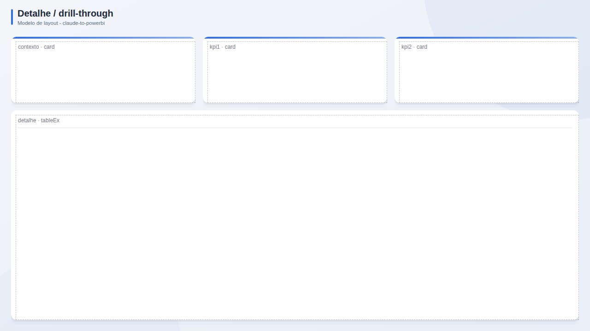

# Detalhe / drill-through

**Publico:** operacao, auditoria  
**Quando usar:** pagina de apoio aberta a partir de outra

## Estrutura
Faixa de contexto (o que foi selecionado), KPIs do item e tabela detalhada ocupando a pagina.

## Slots
| Slot | Visual | Titulo sugerido | Posicao (x, y, LxA) |
|---|---|---|---|
| `contexto` | card | Item selecionado | 24, 80, 400x144 |
| `kpi1` | card | KPI 1 | 440, 80, 400x144 |
| `kpi2` | card | KPI 2 | 856, 80, 400x144 |
| `detalhe` | tableEx | Detalhe | 24, 240, 1232x456 |

## Boas praticas deste layout
- Botao voltar no topo.
- Titulo dinamico mostrando o item filtrado.
- Tabela com exportacao liberada.
