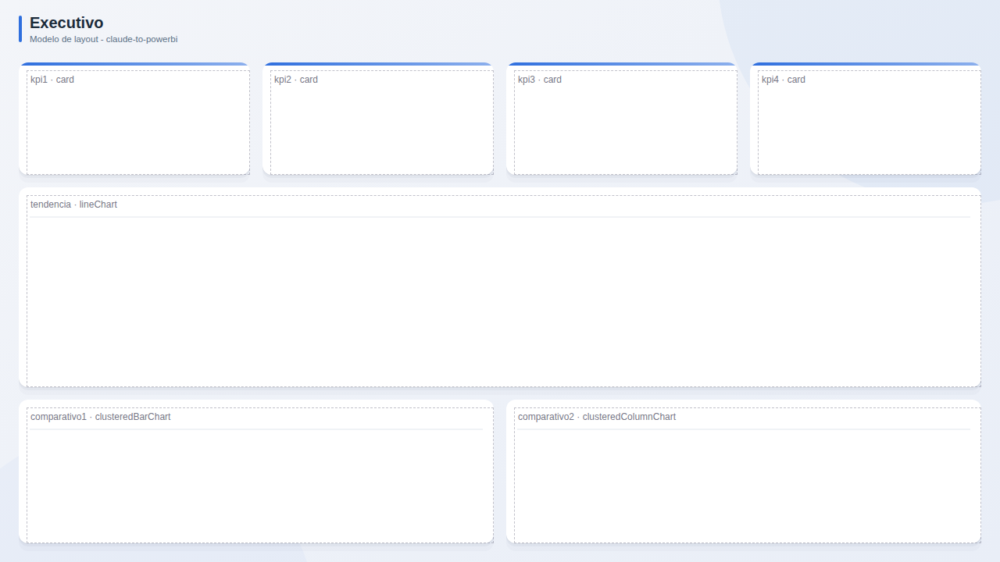

# Executivo

**Publico:** diretoria, conselho  
**Quando usar:** visao mensal/semanal de poucos numeros-chave

## Estrutura
Faixa de 4 KPIs com meta; tendencia principal larga; dois comparativos lado a lado.

## Slots
| Slot | Visual | Titulo sugerido | Posicao (x, y, LxA) |
|---|---|---|---|
| `kpi1` | card | KPI 1 | 24, 80, 296x144 |
| `kpi2` | card | KPI 2 | 336, 80, 296x144 |
| `kpi3` | card | KPI 3 | 648, 80, 296x144 |
| `kpi4` | card | KPI 4 | 960, 80, 296x144 |
| `tendencia` | lineChart | Tendencia do indicador principal | 24, 240, 1232x256 |
| `comparativo1` | clusteredBarChart | Comparativo por dimensao | 24, 512, 608x184 |
| `comparativo2` | clusteredColumnChart | Comparativo por periodo | 648, 512, 608x184 |

## Boas praticas deste layout
- No maximo 6 KPIs; cada um com comparacao (meta, periodo anterior).
- A tendencia responde 'estamos melhorando?'.
- Filtros no painel lateral ou no topo, nunca espalhados.
