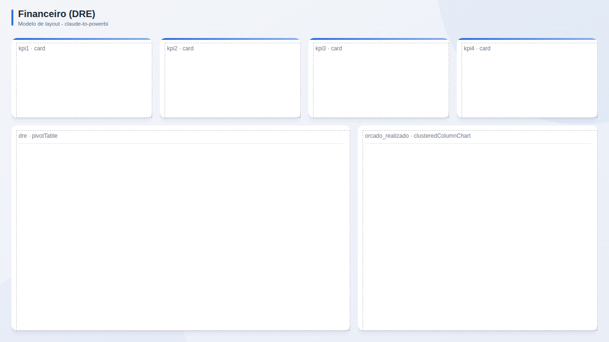

# Financeiro (DRE)

**Publico:** controladoria, CFO  
**Quando usar:** demonstrativo de resultado, orcado x realizado

## Estrutura
KPIs de receita, margem, EBITDA e resultado; matriz DRE; cascata da variacao e orcado x realizado.

## Slots
| Slot | Visual | Titulo sugerido | Posicao (x, y, LxA) |
|---|---|---|---|
| `kpi1` | card | KPI 1 | 24, 80, 296x168 |
| `kpi2` | card | KPI 2 | 336, 80, 296x168 |
| `kpi3` | card | KPI 3 | 648, 80, 296x168 |
| `kpi4` | card | KPI 4 | 960, 80, 296x168 |
| `dre` | pivotTable | DRE | 24, 264, 712x432 |
| `orcado_realizado` | clusteredColumnChart | Orcado x realizado | 752, 264, 504x432 |

## Boas praticas deste layout
- Valores em milhares/milhoes com unidade no titulo.
- Negativos em vermelho e entre parenteses, padrao contabil.
- Cascata explica a ponte entre periodos.
