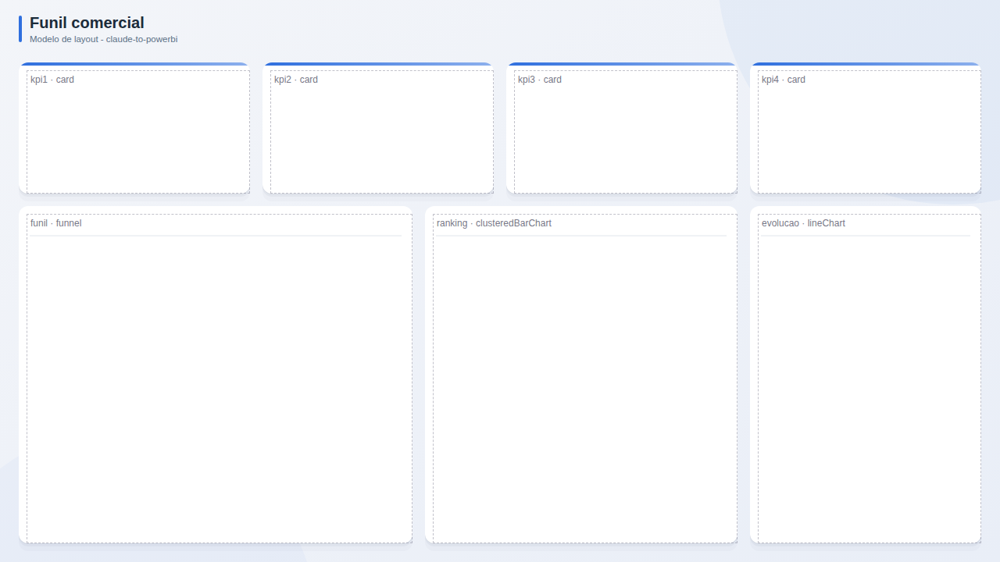

# Funil comercial

**Publico:** vendas, marketing  
**Quando usar:** pipeline, conversao por etapa e desempenho da equipe

## Estrutura
KPIs de receita/conversao, funil grande, ranking de vendedores e evolucao.

## Slots
| Slot | Visual | Titulo sugerido | Posicao (x, y, LxA) |
|---|---|---|---|
| `kpi1` | card | KPI 1 | 24, 80, 296x168 |
| `kpi2` | card | KPI 2 | 336, 80, 296x168 |
| `kpi3` | card | KPI 3 | 648, 80, 296x168 |
| `kpi4` | card | KPI 4 | 960, 80, 296x168 |
| `funil` | funnel | Funil de vendas | 24, 264, 504x432 |
| `ranking` | clusteredBarChart | Ranking de vendedores | 544, 264, 400x432 |
| `evolucao` | lineChart | Receita no tempo | 960, 264, 296x432 |

## Boas praticas deste layout
- Mostrar taxa de conversao entre etapas, nao so volume.
- Ranking ordenado e com meta individual.
