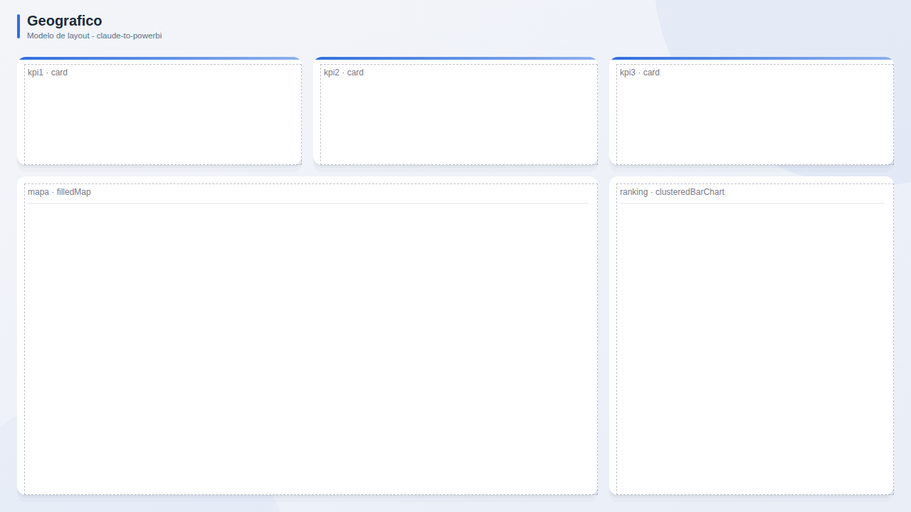

# Geografico

**Publico:** redes de unidades, logistica  
**Quando usar:** comparar desempenho por local

## Estrutura
Mapa grande com ranking lateral e KPIs no topo.

## Slots
| Slot | Visual | Titulo sugerido | Posicao (x, y, LxA) |
|---|---|---|---|
| `kpi1` | card | KPI 1 | 24, 80, 400x152 |
| `kpi2` | card | KPI 2 | 440, 80, 400x152 |
| `kpi3` | card | KPI 3 | 856, 80, 400x152 |
| `mapa` | filledMap | Mapa | 24, 248, 816x448 |
| `ranking` | clusteredBarChart | Ranking por local | 856, 248, 400x448 |

## Boas praticas deste layout
- Dados geograficos limpos (UF, municipio, lat/long).
- Mapa preenchido para taxas; bolhas para volumes.
