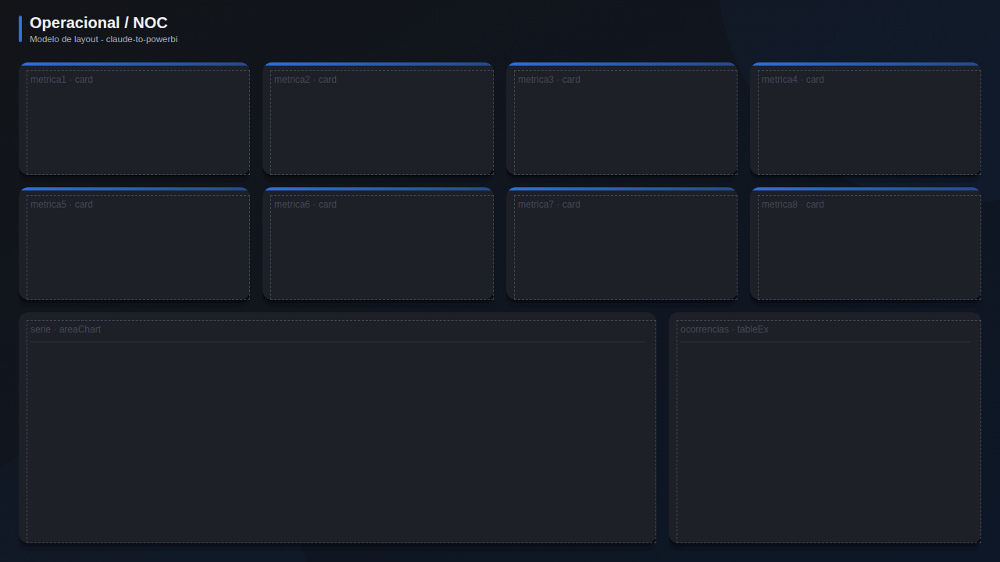

# Operacional / NOC

**Publico:** salas de controle, TV, plantao  
**Quando usar:** monitoramento quase em tempo real

## Estrutura
Grade densa de 8 KPIs pequenos com alerta, serie do dia e lista de ocorrencias. Pensado para fundo escuro.

## Slots
| Slot | Visual | Titulo sugerido | Posicao (x, y, LxA) |
|---|---|---|---|
| `metrica1` | card | Metrica 1 | 24, 80, 296x144 |
| `metrica2` | card | Metrica 2 | 336, 80, 296x144 |
| `metrica3` | card | Metrica 3 | 648, 80, 296x144 |
| `metrica4` | card | Metrica 4 | 960, 80, 296x144 |
| `metrica5` | card | Metrica 5 | 24, 240, 296x144 |
| `metrica6` | card | Metrica 6 | 336, 240, 296x144 |
| `metrica7` | card | Metrica 7 | 648, 240, 296x144 |
| `metrica8` | card | Metrica 8 | 960, 240, 296x144 |
| `serie` | areaChart | Ultimas horas | 24, 400, 816x296 |
| `ocorrencias` | tableEx | Ocorrencias | 856, 400, 400x296 |

## Boas praticas deste layout
- Use --escuro no tema e no fundo.
- Numeros grandes, rotulos curtos, atualizacao visivel.
- Alerta = cor + icone + posicao fixa.
