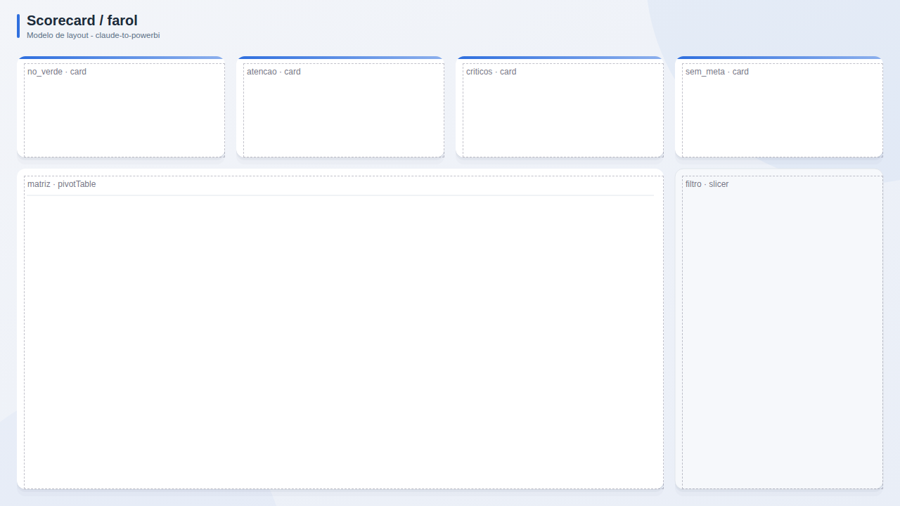

# Scorecard / farol

**Publico:** gestao por metas  
**Quando usar:** acompanhar muitos indicadores contra meta (farol verde/amarelo/vermelho)

## Estrutura
Resumo de status no topo (quantos no verde/amarelo/vermelho), matriz indicador x periodo ocupando a pagina, filtros a direita.

## Slots
| Slot | Visual | Titulo sugerido | Posicao (x, y, LxA) |
|---|---|---|---|
| `no_verde` | card | Na meta | 24, 80, 296x144 |
| `atencao` | card | Atencao | 336, 80, 296x144 |
| `criticos` | card | Criticos | 648, 80, 296x144 |
| `sem_meta` | card | Sem meta | 960, 80, 296x144 |
| `matriz` | pivotTable | Indicadores x periodo | 24, 240, 920x456 |
| `filtro` | slicer | Filtros | 960, 240, 296x456 |

## Boas praticas deste layout
- Status com cor E icone (acessibilidade).
- Respeitar o sentido do indicador (menor pode ser melhor).
- Ordenar por criticidade.
