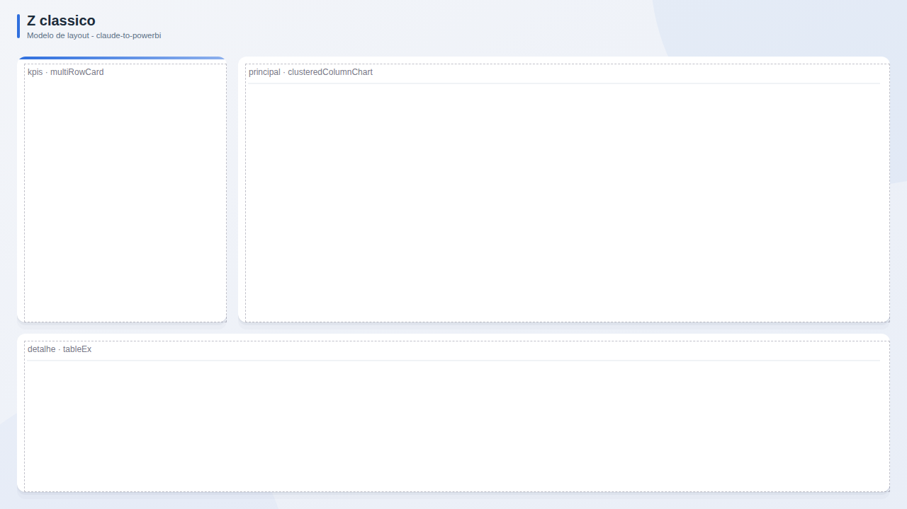

# Z classico

**Publico:** gestores  
**Quando usar:** painel geral de uma area

## Estrutura
Coluna de KPIs empilhados a esquerda, grafico principal grande a direita, detalhe em tabela embaixo (leitura em Z).

## Slots
| Slot | Visual | Titulo sugerido | Posicao (x, y, LxA) |
|---|---|---|---|
| `kpis` | multiRowCard | Indicadores | 24, 80, 296x376 |
| `principal` | clusteredColumnChart | Analise principal | 336, 80, 920x376 |
| `detalhe` | tableEx | Detalhe | 24, 472, 1232x224 |

## Boas praticas deste layout
- O olho comeca em cima a esquerda: coloque ali o KPI mais importante.
- Tabela de detalhe com no maximo 6 colunas.
